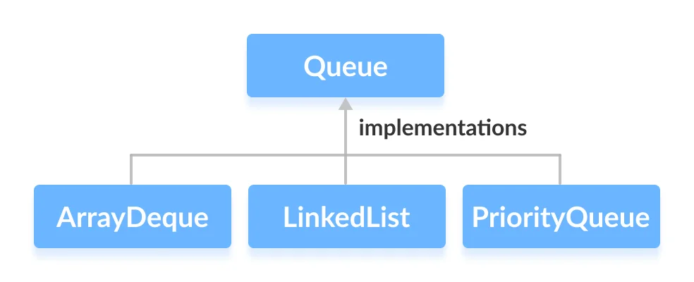
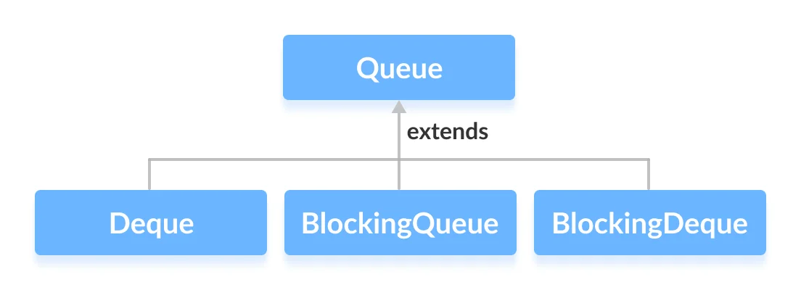
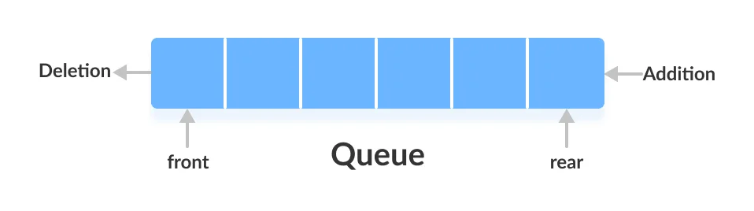

# Java Queue Interface
The Queue interface of the Java collections framework provides the functionality of the queue data structure. It extends the Collection interface.

# Classes that Implement Queue
Since the Queue is an interface, we cannot provide the direct implementation of it.

In order to use the functionalities of Queue, we need to use classes that implement it:

1. ArrayDeque
2. LinkedList
3. PriorityQueue
 


# Interfaces that extend Queue
The Queue interface is also extended by various subinterfaces:

1. Deque
2. BlockingQueue
3. BlockingDeque



## Working of Queue Data Structure
In queues, elements are stored and accessed in First In, First Out manner. That is, elements are added from the behind and removed from the front.



# How to use Queue?
In Java, we must import java.util.Queue package in order to use Queue.
 
```
    // LinkedList implementation of Queue
    Queue<String> animal1 = new LinkedList<>();
    
    // Array implementation of Queue
    Queue<String> animal2 = new ArrayDeque<>();
    
    // Priority Queue implementation of Queue
    Queue<String> animal 3 = new PriorityQueue<>(); 
```

Here, we have created objects animal1, animal2 and animal3 of classes LinkedList, ArrayDeque and PriorityQueue respectively. These objects can use the functionalities of the Queue interface.

# Methods of Queue
The Queue interface includes all the methods of the Collection interface. It is because Collection is the super interface of Queue.

Some of the commonly used methods of the Queue interface are:

* add() - Inserts the specified element into the queue. If the task is successful, add() returns true, if not it throws an exception.
* offer() - Inserts the specified element into the queue. If the task is successful, offer() returns true, if not it returns false.
* element() - Returns the head of the queue. Throws an exception if the queue is empty.
* peek() - Returns the head of the queue. Returns null if the queue is empty.
* remove() - Returns and removes the head of the queue. Throws an exception if the queue is empty.
* poll() - Returns and removes the head of the queue. Returns null if the queue is empty.

## Implementation of the Queue Interface
1. Implementing the LinkedList Class

```java
import java.util.Queue;
import java.util.LinkedList;

class Main {

    public static void main(String[] args) {
        // Creating Queue using the LinkedList class
        Queue<Integer> numbers = new LinkedList<>();

        // offer elements to the Queue
        numbers.offer(1);
        numbers.offer(2);
        numbers.offer(3);
        System.out.println("Queue: " + numbers);

        // Access elements of the Queue
        int accessedNumber = numbers.peek();
        System.out.println("Accessed Element: " + accessedNumber);

        // Remove elements from the Queue
        int removedNumber = numbers.poll();
        System.out.println("Removed Element: " + removedNumber);

        System.out.println("Updated Queue: " + numbers);
    }
}

```

Output
```
Queue: [1, 2, 3]
Accessed Element: 1
Removed Element: 1
Updated Queue: [2, 3]
```

2. Implementing the PriorityQueue Class
```java
import java.util.Queue;
import java.util.PriorityQueue;

class Main {

    public static void main(String[] args) {
        // Creating Queue using the PriorityQueue class
        Queue<Integer> numbers = new PriorityQueue<>();

        // offer elements to the Queue
        numbers.offer(5);
        numbers.offer(1);
        numbers.offer(2);
        System.out.println("Queue: " + numbers);

        // Access elements of the Queue
        int accessedNumber = numbers.peek();
        System.out.println("Accessed Element: " + accessedNumber);

        // Remove elements from the Queue
        int removedNumber = numbers.poll();
        System.out.println("Removed Element: " + removedNumber);

        System.out.println("Updated Queue: " + numbers);
    }
}

```
Output
```
Queue: [1, 5, 2]
Accessed Element: 1
Removed Element: 1
Updated Queue: [2, 5]
```

# ***Difference between add() and offer() methods in Queue in Java***

Add() and Offer() are the methods used for adding the elements in the Queue. But both have their main function and they treat the elements differently.

### add() method in Java:
It Inserts the specified element **to the end of the queue if there is space**, returning true upon success and throwing an IllegalStateException if no space is currently available. This method returns a boolean value depicting the successfulness of the operation. If the element was added, it returns true, else it returns false.

Exceptions: This method throws 5 exceptions listed below as follows:

UnsupportedOperationException: if the add operation is not supported by this collection
ClassCastException: if the class of the specified element prevents it from being added to this collection
NullPointerException: if the specified element is null and this collection does not permit null elements
IllegalArgumentException: if some property of the element prevents it from being added to this collection
IllegalStateException: if the element cannot be added at this time due to insertion restrictions
Below is the Implementation of add() method in java:

Exceptions: This method throws 5 exceptions listed below as follows:

* UnsupportedOperationException: if the add operation is not supported by this collection
* ClassCastException: if the class of the specified element prevents it from being added to this collection
* NullPointerException: if the specified element is null and this collection does not permit null elements
* IllegalArgumentException: if some property of the element prevents it from being added to this collection
* IllegalStateException: if the element cannot be added at this time due to insertion restrictions

```java
// add() method:

import java.util.*;

public class Main {
	public static void main(String[] args)
	{
		// Creating Queue using the LinkedList
		Queue<Integer> numbers = new LinkedList<>();

		// Insert element at the rear of the queue
		// using add method
		numbers.add(1);
		numbers.add(2);
		numbers.add(3);
		System.out.println("Queue using add method: "
						+ numbers);
	}
}

```
``` 
Output
Queue using add method: [1, 2, 3]
```
If the element cannot be added at this time due to insertion restrictions:

```java
import java.util.*;

class GFG {
	public static void main(String[] args)
	{
		ArrayList<String> nums = new ArrayList<String>();

		// Adding Elements
		nums.add("CS");
		nums.add("Mech");
		nums.add("Electrical");

		Iterator<String> itr = nums.iterator();
		itr.remove();
	}
}

```
```
Output:
Exception in thread "main" java.lang.IllegalStateException
    at java.base/java.util.ArrayList$Itr.remove(ArrayList.java:1010)
    at GFG.main(GFG.java:13)
```
### Offer() method in Java:
It Inserts the specified element into this queue if it is possible to do so immediately without violating capacity restrictions. When using a capacity-restricted queue, this method is generally preferable to add(E), which can fail to insert an element only by throwing an exception.

Parameters: This method accepts a mandatory parameter e which is the element to be inserted in the Queue.

Returns: This method returns true on successful insertion else it returns false.

Exceptions: The function throws three exceptions which are described below:

* ClassCastException: when the class of the element to be entered prevents it from being added to this container.
* IllegalArgumentException: when some property of the element prevents it to be added to the queue.
* NullPointerException: when the element to be inserted is passed as null and the Queue’s interface does not allow null elements.
* Below is the Implementation of offer() method in java:

```java
import java.util.*;

public class Main {
	public static void main(String[] args)
	{
		// Creating Queue using the LinkedList
		Queue<Integer> numbers = new LinkedList<>();

		// Insert element at the rear
		// of the queue using offer
		numbers.offer(1);
		numbers.offer(2);
		numbers.offer(3);
		numbers.offer(4);
		System.out.print("Queue using offer method: "
						+ numbers);
	}
}

```
```
Queue using offer method: [1, 2, 3, 4]
```
```java
import java.util.*;

class GFG {
	public static void main(String[] args)
	{
		// Declaration for priority Queue
		Queue<String> str = new PriorityQueue<String>();

		// Adding Elements
		str.offer("CS");
		str.offer("Mechanical");
		str.offer("Electrical");
		str.offer("Civil");

		System.out.print(str);
	}
}

```
```
[CS, Civil, Electrical, Mechanical]
```
# Difference between add() and offer() method in java


 
